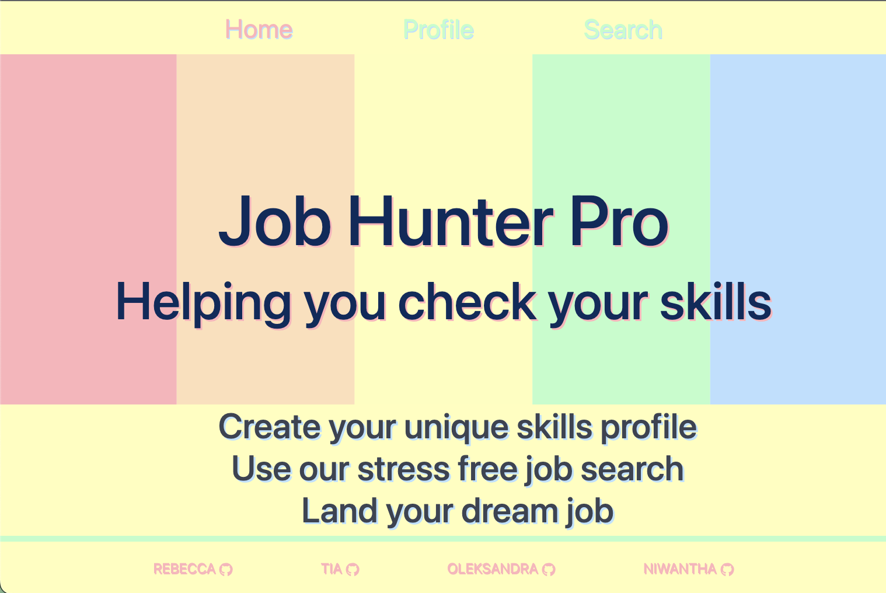

# 🔆 Job-Hunter-Pro!

##  ✒️ Description 
Welcome to Job Hunter Pro.
We created this app to allow newly graduated bootcamp students to not only find desired job vacancies to a specific area, but also to compare the job's required skills with the graduates own so that they can see what they need to work on.
The intention of this project was to make finding a job after completing a skills bootcamp, easy and seamless, with guidance on how one can self improve, as we acknowledge finding a job after this bootcamp to be a problem we will all have to resolve post-bootcamp. On this project we learnt how to work as a team, navigating time zone issues and team member absences, we came together for the decision-making to ensure everyone was aligned, and we were able to troubleshoot arising issues together.

The deployed application can be found here at:

https://job-hunter-pro.netlify.app/

## 🗝️ User Story

As a bootcamp graduate, I want to find a new job, using an app to check and choose the jobs that I like and compare skills. If I don't have enough skills, I want to create a list of skills I need to improve and see my progress.

## 📝Usage 
The navbar has three links: home, profile and search which once clicked will direct the user to the respective pages of the app. Links to the project's participants GitHub pages appear in footer, which is stiched to the bottom.

The Home page contains the name of this Project and a short message regarding to it.

You can find two crads on the Profile page. One of them creates a user profile by entering data into the input fields on the top of the page. The other one generates a skill card with skills that you already have, so you could be in good understanding what to look for next.

On the Search page you can actually search for the job by position and location. After API makes a call and generates data, you will see cards one by one using Swiper. Each card contains job title, location, employment type, company-employer and 2 buttons: job description and link to the actual website where you can check for more information.

### ➕ Suggestions for improvement
+ Add a card for skills to improve
+ Create a progress bar to show user's learning progress
+ Add more input fields to make user's profile more extended
+ Create a login and password input 

## 🔗 Installation
This application does not require instalation, however you need to create your own API-key on [Rapid API](https://rapidapi.com/letscrape-6bRBa3QguO5/api/jsearch) and do npm i to install all necessary packages.

## ⭐ Credits
This project was created as part of a coding assignment with [Trilogy Education Services](https://skillsforlife.edx.org/?utm_source=govuk)

## 💻 Contributing
[Oleksandra Zhyliuk](https://github.com/SashaK2609)
[Tia Yorke](https://github.com/tyrkgithub)
[Rebecca Wood](https://github.com/ResonantDevotion)
[Nirwantha Meepage](https://github.com/niwantha33)

## 📜 License
Please refer to the license in the repo.